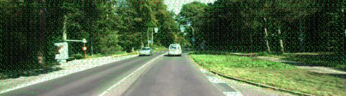
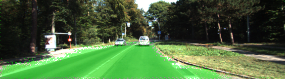
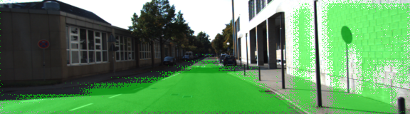
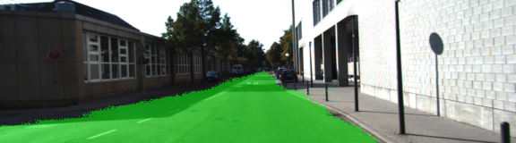
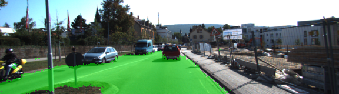
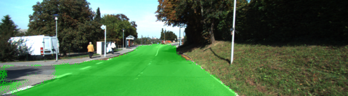
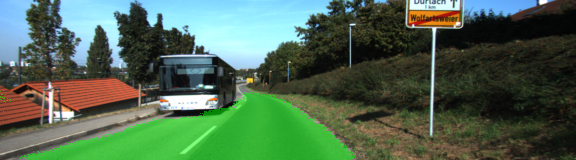
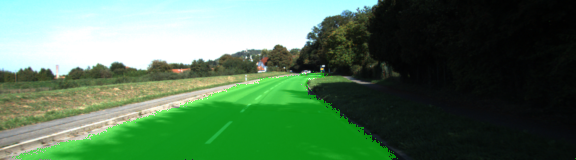

# Semantic Segmentation

In this project I used a fully convolutional network (FCN-8) to perform semantic segmentation.

## Architecture

To get going I implemented the skeleton methods provided by Udacity. I built a FCN-8 architecture
as described in [this paper](https://people.eecs.berkeley.edu/~jonlong/long_shelhamer_fcn.pdf):


This network uses a VGG-16 network as part of the encoder. In contrast to regular convolutional
networks that only output labels based on the whole image (like if it pictures a cat or a dog),
a fully convolutional network like this can preserve the information *where* the cat or the dog
is by using _1x1 convolutions_. Combined with the technique of _upsampling_, this enables the
network to output the label information on the same size of the input image.

Here, we use the FCN-8 network to classify pictures of streets and want to separate street-pixels
from non-street-pixels. We will also use another technique described in the FCN-8 architecture:
The use of _skip connections_. Usually the details of the original image are lost during the encoding
process. As a result, the output of the decoder will loose a lot of details of the original picture, as
can be seen in the paper (FCN-32 architecture has no skip connections).
The FCN-8 network uses two skip connections.

The implementation of the full FCN-8 network (encoder + decoder) can be seen in [main.py](main.py#L21-L93).
I want to point out that the code could be greatly simplified by adding two lambda methods. Here the decoder part
including 1x1 convolutions and skip connections:

```python
# define some helper functions here so the code is more readable
def conv1x1(input):
    return tf.layers.conv2d(input, num_classes, 1, padding='same',
                            kernel_regularizer=tf.contrib.layers.l2_regularizer(1e-3))

def upsample(input, factor):
    return tf.layers.conv2d_transpose(input, num_classes, factor * 2, factor, padding='same',
                                      kernel_regularizer=tf.contrib.layers.l2_regularizer(1e-3))

# create 1x1 convolutions of desired VGG layers for later use
layer7_1x1 = conv1x1(vgg_layer7_out)
layer4_1x1 = conv1x1(vgg_layer4_out)
layer3_1x1 = conv1x1(vgg_layer3_out)

# Decoder layer 7
x = layer7_1x1

# Decoder layer 4 with skip connection
x = tf.add(
    upsample(x, factor=2),
    layer4_1x1)

# Decoder layer 3 with skip connection
x = tf.add(
    upsample(x, factor=2),
    layer3_1x1)

# Final upsampling of decoder
return upsample(x, factor=8)
```

In `main.py` I also printed the shapes of the layers, e.g. here the VGG layers,
their 1x1 convolutions and the final output shape:

```
2017-11-23 13:19:58.824994: I tensorflow/core/kernels/logging_ops.cc:79] VGG layers 7, 4, 3: [4 5 18 4096][4 10 36 512][4 20 72 256]
2017-11-23 13:19:58.825041: I tensorflow/core/kernels/logging_ops.cc:79] 1x1 of VGG layers 7, 4, 3: [4 5 18 2][4 10 36 2][4 20 72 2]
2017-11-23 13:19:58.837856: I tensorflow/core/kernels/logging_ops.cc:79] Final output: [4 160 576 2]
```

Here we can observe that the 1x1 convolutions indeed preserve the spatial information,
while also generating output for our 2 labels. The final output image shape is `576x160` - the same
as the input image shape.

## Training

I trained and tested the model on the [Kitti Road dataset](http://www.cvlibs.net/datasets/kitti/eval_road.php).
I used an AdamOptimizer with a learning rate of `0.001` minimizing the cross entropy, as can be seen in the [code](main.py#L109-L112):

```python
logits = tf.reshape(nn_last_layer, (-1, num_classes))
labels = tf.reshape(correct_label, (-1, num_classes))
cross_entropy_loss = tf.reduce_mean(tf.nn.softmax_cross_entropy_with_logits(logits=logits, labels=labels))
train_op = tf.train.AdamOptimizer(learning_rate=learning_rate).minimize(cross_entropy_loss)
```

First I tried to train 1 epoch on my local machine without GPU to verify it was working.
Although the loss usually decreased, the initial result was not what I expected:



I decided that the data was not enough for my neural net to learn the concept of a street, so I decided
to give it one more try on my local machine with 10 epochs:



This looked much better, but it still made some larger errors on some of the images:



Finally, I decided to fit the whole training set 42 times. For that I could have run it on my local machine
over night. Instead, I decided to launch an AWS spot instance with a Tegra K60 GPU. This machine
could train the model in minutes. Here are some of the [final results](last_run):







As you can see the results improved a lot. The network even learned to recognize streets
where the street was covered by shadows.

## Discussion

It is astounding to see that fully convolutional networks can learn to differentiate
different parts of images and locate them. I really liked that the network learned
what a street is based on only a relatively small dataset of less than 100 images,
although I had to increase the number of epochs so the model could actually learn.

What is even more cool is that the same principle should work for cars, pedestrians,
bikes, traffic lights, signs and more. We only need to manually label some data so we can pass
it to the network. An awesome tool for this is the coloring website by comma.ai:
http://commacoloring.herokuapp.com/

I also learned from this project that my local machine is much too slow for learning
deep neural nets, and that even a Tegra K60 GPU takes some time to learn.
It will be interesting to see how quick we will be able to learn neural nets in the
future using a combination of multiple graphic cards, or even better on dedicated
hardware like the new Tensorflow Processing Units (TPUs)!


---

### Introduction
In this project, you'll label the pixels of a road in images using a Fully Convolutional Network (FCN).

### Setup
##### Frameworks and Packages
Make sure you have the following is installed:
 - [Python 3](https://www.python.org/)
 - [TensorFlow](https://www.tensorflow.org/)
 - [NumPy](http://www.numpy.org/)
 - [SciPy](https://www.scipy.org/)
##### Dataset
Download the [Kitti Road dataset](http://www.cvlibs.net/datasets/kitti/eval_road.php) from [here](http://www.cvlibs.net/download.php?file=data_road.zip).  Extract the dataset in the `data` folder.  This will create the folder `data_road` with all the training a test images.

### Start
##### Implement
Implement the code in the `main.py` module indicated by the "TODO" comments.
The comments indicated with "OPTIONAL" tag are not required to complete.
##### Run
Run the following command to run the project:
```
python main.py
```
**Note** If running this in Jupyter Notebook system messages, such as those regarding test status, may appear in the terminal rather than the notebook.

### Submission
1. Ensure you've passed all the unit tests.
2. Ensure you pass all points on [the rubric](https://review.udacity.com/#!/rubrics/989/view).
3. Submit the following in a zip file.
 - `helper.py`
 - `main.py`
 - `project_tests.py`
 - Newest inference images from `runs` folder  (**all images from the most recent run**)
 
 ## How to write a README
A well written README file can enhance your project and portfolio.  Develop your abilities to create professional README files by completing [this free course](https://www.udacity.com/course/writing-readmes--ud777).
